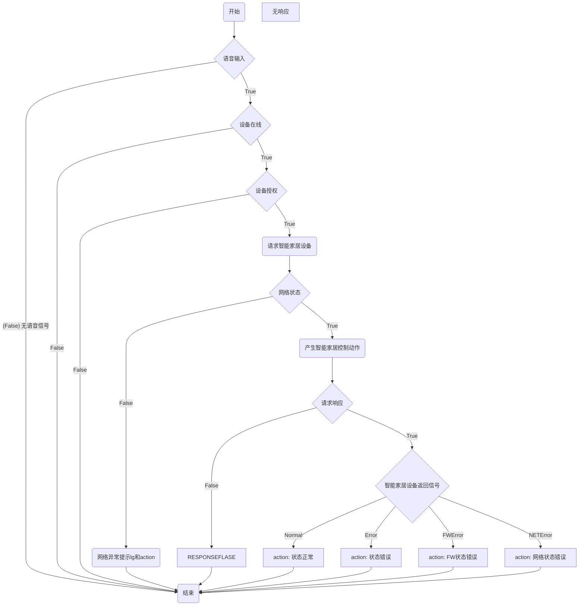

```mermaid
graph TD;
    START(开始)-->TESTINPUT{语音输入}
    TESTONLINE{设备在线}
    TESTAUTH{设备授权}
    REQUEST(请求智能家居设备)
    NETSTATE{网络状态}
    NETERROR(网络异常提示lg和action)
    RESPONSE{请求响应}
    RESPONSEFALSE[无响应]
    ACTIONSMARTHOME(产生智能家居控制动作)
    END(结束)
    TESTINPUT -- "(False) 无语音信号"--> END
    TESTINPUT -- True --> TESTONLINE
    TESTONLINE -- False --> END
    TESTONLINE -- True --> TESTAUTH
    TESTAUTH -- False --> END
    TESTAUTH -- True --> REQUEST
    REQUEST  --> NETSTATE
    NETSTATE -- False --> NETERROR
    NETERROR --> END
    NETSTATE -- True --> ACTIONSMARTHOME
    ACTIONSMARTHOME -->RESPONSE
    RESPONSE -- False --> RESPONSEFLASE
    RESPONSEFLASE --> END
    RESPONSE -- True --> SMARTCTRLSTATUS{智能家居设备返回信号}
    SMARTCTRLSTATUS -- Normal --> ACTIONNORMAL[action: 状态正常]
    ACTIONNORMAL --> END
    SMARTCTRLSTATUS -- Error --> ACTIONFALSE[action: 状态错误]
    ACTIONFALSE --> END
    SMARTCTRLSTATUS -- FWError --> ACTIONFWFALSE[action: FW状态错误]
    ACTIONFWFALSE --> END
    SMARTCTRLSTATUS -- NETError --> ACTIONNETFALSE[action: 网络状态错误]
    ACTIONNETFALSE --> END
```

